# Tutorial 5: The Real Turtlebot 4

#### Development of Inteligent Systems, 2024

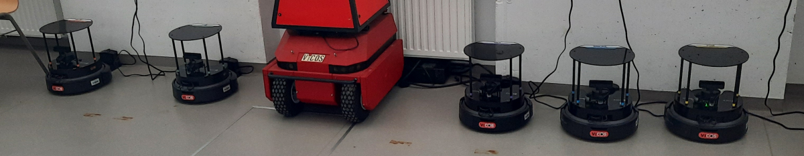
*The Company of iRobot*

### Robot Status

The Create3 base comes with a built-in LED ring around the main power button, which indicates the robot state. The other two buttons around it are unassigned by default and can be used for custom actions.

| State Description | Robot LED State |
|------|-------|
| The Create3 is powered off, the Pi 4 power supply has been cut. In this state the robot can only be activated by placing it back on the dock. | 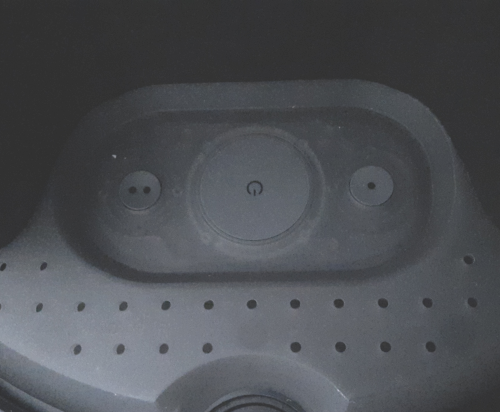 |
| The battery is charging, the robot is on the dock. | 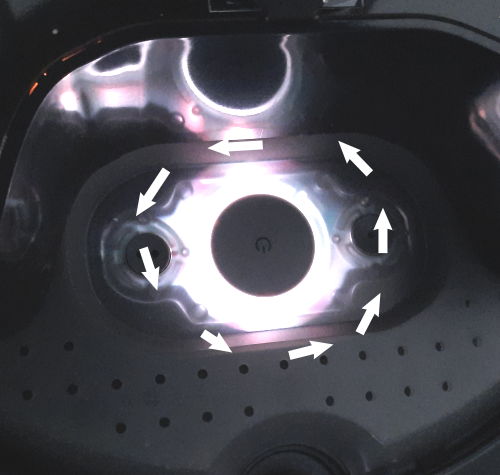 |
| Normal operating state | 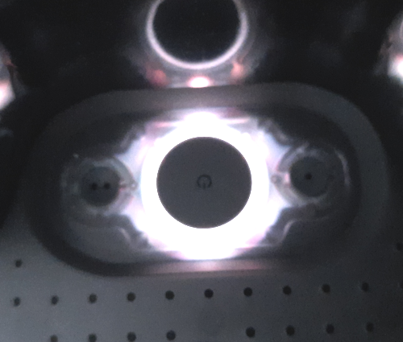 |
| Emergency stop (ESTOP) has been triggered, either due to hitting a bumper/IR/cliff switch or because there's no communication with the Pi 4. It can be reset by pressing the power button once, or through ROS |  |
| Battery is low, if you don't recharge the robot soon it will automatically power off. Place the robot back on the dock and power off the Pi 4 so it can recharge faster. | 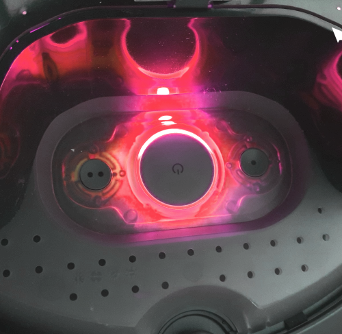 |

## Turning off the robot when you are done working with it
The Turtlebot 4 consists of two DDS connected machines, the Pi 4 and the Create3 which are internally connected via USB-C. Both must be powered on for the robot to work properly.

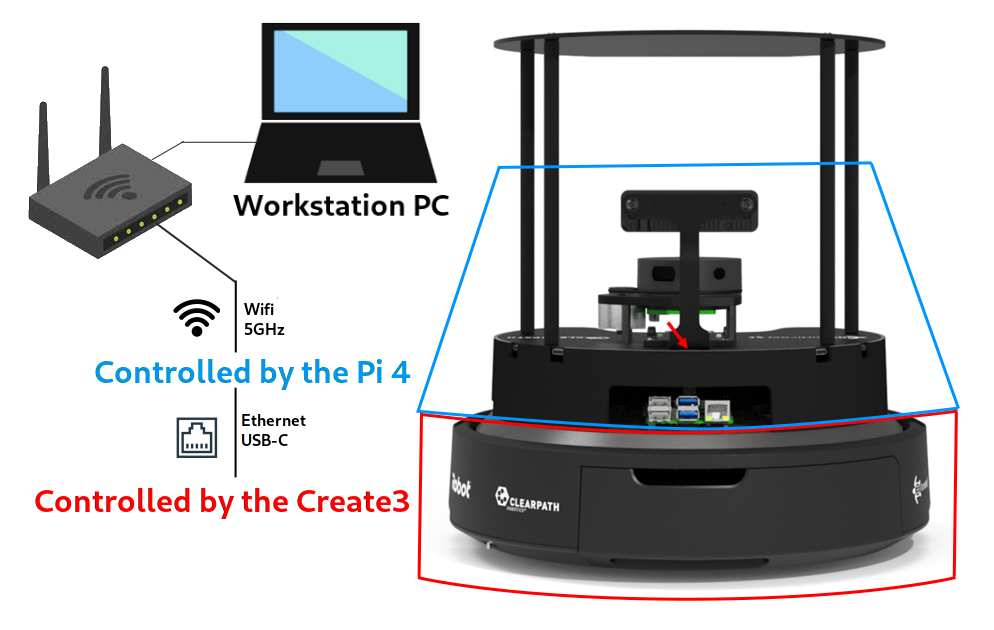
*Image source: [Clearpath Robotics](https://turtlebot.github.io/turtlebot4-user-manual/mechanical/turtlebot4.html#removing-the-pcba)*

To keep robots charged and ready for use, follow these steps when you finish work:
- Place the robot on the charging dock (green LED on the dock should turn on).
- If the robot was completely powered off before, wait until the chime sound
- Hold the Pi Shutdown button for a few seconds (the lidar should stop spinning).

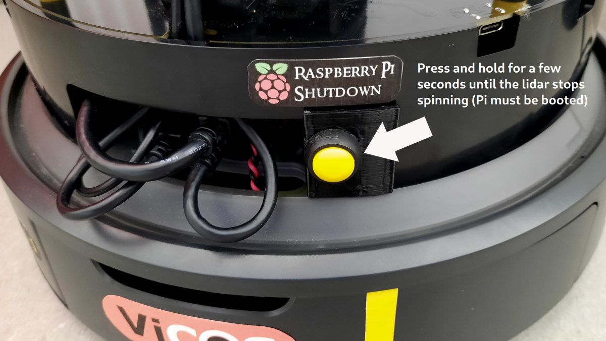

## STEP 1 - Turning on/restarting the robot 

To resume work with the robot:
- Remove the robot from the dock.
- Hold the Create3 power button for 10 seconds so the base powers down.
- Place the robot back on the dock for both computers to boot in sync.
- Wait for the beep (it may take a minute or two).

> Note that the Create3 cannot be turned off while on the charging station, and the only way to turn it on when it's powered off is to place it on the dock. If the power is cut to the Pi 4 by turning off the Create3 before executing safe shutdown, it might corrupt the SD card.

If the buttons on the display do not respond or the display is off, it means that the Pi 4 is powered off, unless the lidar is spinning, in which case the ROS 2 nodes that handle the screen may not running or the boot process hasn't finished yet.


## STEP 2 - Connecting to the robot from your workstation

Your computer should be connected to the Turtlenet network. After it is connected, you need to run a script each time you work with a different Turtlebot. On each robot you can see the ROS_DOMAIN_ID and the current IP address (on the small display.)

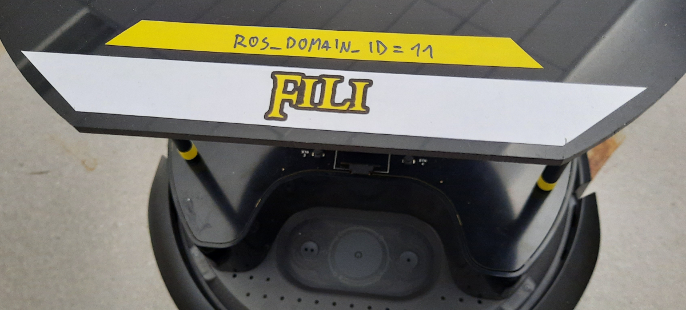
*The sticker with the ROS_DOMAIN_ID, different for each robot

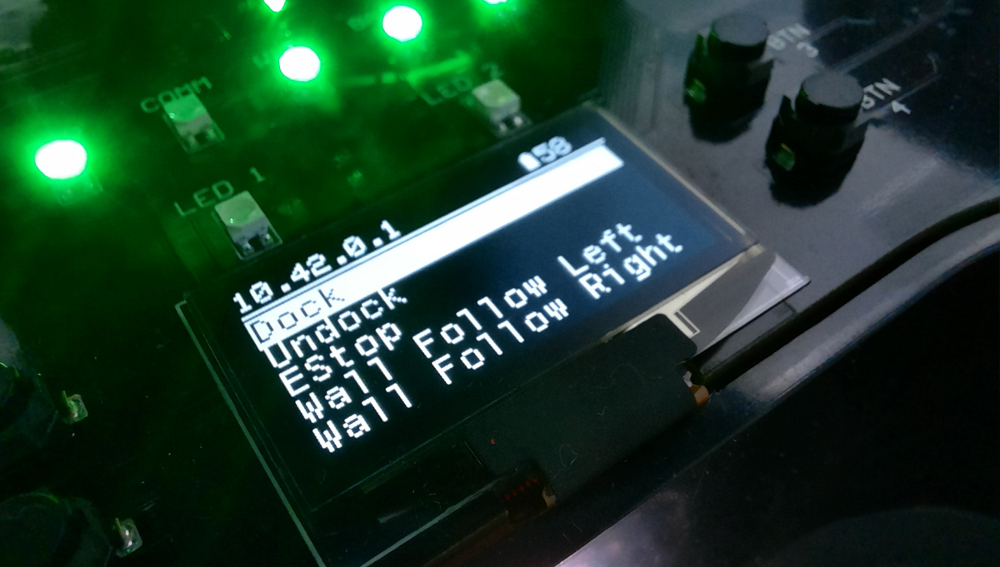
*OLED display: The first line shows the IP address. Buttons 3 and 4 select the action, button 1 confirms it, button 2 scrolls back to top. The top bar shows battery level and IP address*

Run the script in this tutorial (or follow the [official manual](https://turtlebot.github.io/turtlebot4-user-manual/setup/discovery_server.html#user-pc)):
```
    bash configure_discovery.sh </dev/tty
```

The script will ask you for the following:

- RPi4 IP address: *write the ip address from the robot display
- Discovery Server IP: *press enter
- Discovery Server port: *press enter
- ROS_DOMAIN_ID: *write the ROS_DOMAIN_ID from the top plate of the robot

Note that this will add a `source /etc/turtlebot4_discovery/setup.bash` into your `~/.bashrc` file, which needs to be commented out when running a simulation setup.

Then, restart the ros2 daemon:
```
    ros2 daemon stop
    ros2 daemon start
```
 
Then, source .bashrc, or re-open any terminals so the new `.bashrc` is properly sourced. This should be it!

Check 1 - To check if the robot is properly connected you can inspect topics with:

    ros2 topic list

You should see a lot of topics.

Check 2 - See if you can move the robot with keyboard teleoperation:

    ros2 run teleop_twist_keyboard teleop_twist_keyboard

You should be able to move the robot.

Check 3 - See if you are receiving the `/odom` messages:

    ros2 topic echo /odom

If you have passed all the checks, you can move on with building a map and navigating the robot.

## Building a map

The procedure for building a map is a little simpler than when using the simulation, we only need to start the SLAM and the keyboard teleoperation. Please follow the [official tutorial](https://turtlebot.github.io/turtlebot4-user-manual/tutorials/generate_map.html).

## Navigating a map

Once you have save a map, we can navigatte the robot on the map. Again, follow the [official tutorial](https://turtlebot.github.io/turtlebot4-user-manual/tutorials/navigation.html).

## Transform frames

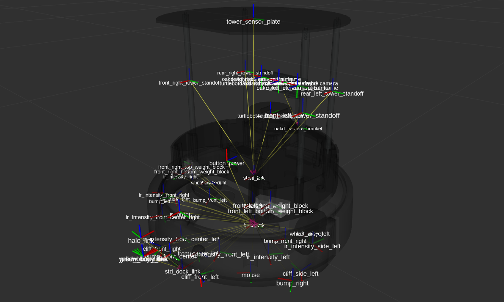

The transform system in ROS 2 is a standardized way to define and handle coordinate frames and transforms between them. It comprises of two topics: `/tf` and `/tf_static`, as well as a collection of libraries for python and C++.

Every robot is defined by a collection of coordinate frames, with `base_link` being considered the parent frame for the current robot. Other common frames include:

- `base_footprint` - typically below base link, where the robot meets the ground
- `odom` - the transformation between the location where the robot started and where it is now, based on wheel encoder data
- `map` - the correction for odometry drift, usually calculated based on external landmarks
- `world` or `earth` - localizes one or multiple robots on the world WGS84 system based on GNSS or other global data
- sensor frames like `camera`, `imu`, `laser`, `sonar`, etc. which reflect the position and rotation of sensors mounted on the real robot, so their data can be accurately transformed into other frames

When multiple robots are in the same TF graph, the conventional way to separate them is using namespacing, i.e. prepending a robot name to the frames. that way `/robot1/base_link` can be distint from `/robot2/base_link` while using the same conventions or even be built from the same URDF file.

You can use the following command to collect and view currently available frames:

    ros2 run tf2_tools view_frames

If you're running the turtlebot simulator, the generated PDF should look something similar as the excerpt below, a full graph of all connected frames:

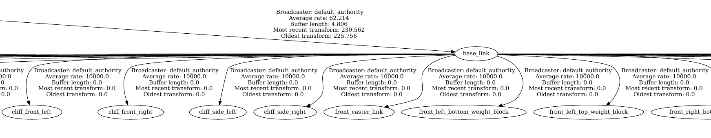

Check the [official documentation page](https://docs.ros.org/en/humble/Tutorials/Intermediate/Tf2/Introduction-To-Tf2.html) for more info.
